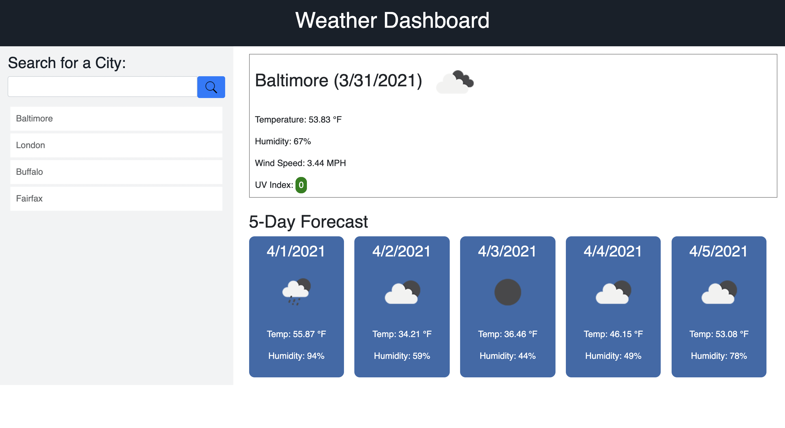

# Weather Dashboard

## Desctiption

Users will be able to see the current weather of any city across the world, including temperature, humidity, wind speed, UV index, and an icon of the weather. In addition, any time a city is entered into the search field, a forecast of the next 5 days will be shown, including a weather icon, temperature, and humidity.

## Installation

There is no installation required to use this webpage.

## Usage

When a user enters the name of any city and clicks the search button, they will see the current weather of that city, in addition to the forecast of that city for the next 5 days. Once a user has searched for a city, it will appear in a list beneath the search bar, even after a page is refreshes. Users can click on previous searches to quickly pull up weather information from those cities.

## Features

This webpage features semantic HTML as well as responsive design. The page has 2 break points (768px and 992px) and will display nicely across any size screen.

## Technologies Used

HTML, CSS, JS, JQuery, OpenWeatherMap API

## Credits

Jeff DeRosalia, Dan Rosenbaum

## Link

https://ryanascherr.github.io/weather-dashboard/

## Contact Information

ryanascherr@gmail.com
